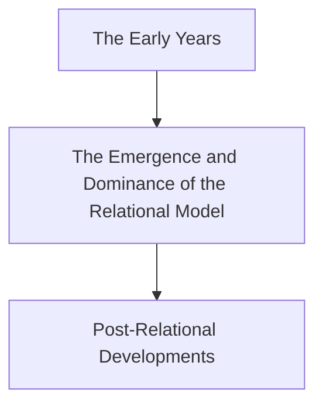

# Chaper 1 Introduction
[TOC]
## 1. The Characteristics of Databases
1. Purpose:
	The purpose of a database is to help people track of things, and the most commonly used type of database is the relational database.

2. Data
	- Data are recorded facts and numbers
	- A **table** has rows and columns, like those in a spreadsheet.
	- Each row of table has data about a particular occurrence or instance of the  thing  of interest.
	> Because each row records the data for  a specific instance, rows are also known as records. Each column of a table stores a characteristic  common to all rows.
	- A primaty key to uniquely identify each row
	- A Database Has Data and Relationships
	- A foreign key provides the link between two tables.
	- Each row in a table is uniquely indentified by a primary key, and the values of these keys are used to create the relationships between the tables.

3. Information(*define*)
	+ Knowledge derived from data
	+ Data presented in a meaningful context
	+ Data processed by summing, ordering, averaging, grouping, comparing or other similar perations

4. Summary
	To summarize, relational database store data in tables, and they represent the relationships among the rows of those tables. They do so in a way that facilitates the production of information.
---
## 2. Database Examples
1. Kind
	Single-User Database Application
	Multiuser Database Application
2. Examples
	CRM Customer Relationship Management
    Sales contact manager
	Patient appointment(doctor, dentist)
    Enterprise Resource Planning(ERP)
	E-commerce site
	Digital dashboard
	Data mining

## 3. the Components of  a Database System
1. Components
	+ users
	+ the database application
	+ the database management system(DBMS)
	+ the database
2. Database
	The database is a collection of related tables and other structures.
3. DBMS
	+ The database management system (DBMS) is a computer program used to create, process, and administer the database.
	+ The DBMS receives requests encoded in SQL and translates those requests into actions on the database.
	+ The DBMS is a large, complicated program that is licensed from a software vendor; companies almost never write their own DBMS programs.
4. Database application
	+ A database application is a set of one or more computer programs that serves as an intermediary between the user and the DBMS.
	+ Application programs read or modify database data by sending SQL statements to the DBMS.
	+ Application programs also present data to users in the format of forms and reports. Application programs can be acquired from software vendors, and they are also frequently written in-house.
5. Users
	Users, the fourth component of a database system, **employ a database application to keep track of things.** They use forms to read, enter, and query data, and they produce reports to convey information.
6. Basic Functions of Application Programs
	+ Create and process forms
	+ Process user queries
	+ Create and process reports
	+ Execute application logic
	+ Control application
7. SQL
	Structured query language.
    This SQL statement is a query statement, which asks the DBMS to obtain specific data from a database.
8. Database functions
	- Create database
	- Create tables
	- Create supporting structures
	- Read database data
	- Modify (insert, update, or delete) database data
	- Maintain database structures
	- Enforce rules
	- Control concurrency
	- Provide security
	- Perform backup and recovery
	> 1. A DBMS is used to create a database and to create the tables and other supporting structures inside that database.
	> 2. Read and modify database data.
	> 3. Maintain all the database structures
9. Metadata
    It is data about data.

   > Databases contain not only tables of user data, but also tables of data that describe that user data.Such descriptive data is called metadata.
10. Others
	1. **Indexes**:indexes are structures that speed the sorting and searching of database data.
	2. **Triggers**  are used to maintaindatabase accuracy and consistency and to enforce data constraints.
	3. **Stored procedures** are used for database administration tasks and are sometimes part of database applications.
	4. Security data define users, groups, and allowed permissions for users and groups.

## 4. Personal Versus Enterprise-Class  Database System
1. Two classes
	+ Personal database systems
	+ Enterprise-class database systems
2. Examples

  - Microsoft access
3. Category
	- Application running over corporate network Client/server applications
	- E-commerce and other applications that run on a Web server
	- Reporting applications that publish the results of database queries on a corporate portal or other Web site
	- XML Web services
	> All of these database applications get and put database data by sending SQL statements to the DBMS. These applications may create forms and reports, or they may send their results to other programs.
	> Note:Enterprise-class can process larger databases, faster, and it includes features for multiuser control, backup and recovery, and other administrative functions.

## 5.Database Design
1. Define
	Determining the proper structure of tables, the proper relationships among tables, the appropriate data constraints, and other structural components.
2. Types
	+ Database design from existing data
	+ Database design for new systems development
	+ Database redesign of an existing database
3. From existing data
	+ Analyze spreadsheets and other data tables
	+ Extract data from other databases
	+ Design using normalization principles
4. New systems development
	+ Create data model from application requirements
	+ Transform data model into database design
	> ER -> entity relationship

5. Database redesign
	+ Migrate databases to newer databases
	+ Integrate two or more databases
	+ Reverse engineer and design new databases using normalization principles and data model transformation

## 6.What You to Learn
1. Users
	+ As a user, you may be a knowledge worker who prepares reports, mines data, and does other types of data analysis or you may be a programmer who writes applications that process the database.
	+ Users are primarily concerned with constructing SQL statements to get and put the data they want.
2. Administrators
	+ Administrator who designs, constructs, and manages the database itself.
	+ Database administrators are primarily concerned with the management of the database.

## 7.A Brief of Database Processing

| Era | Years | Important products |
|--------|--------|
| Predatabase | Before 1970 | File managers |
| Early database | 1970-1980 | ADABAS,System2000 |
| Emergence of  relational model | 1978-1985 | DB2,Oracle |
| Microcomputer DBMS products | 1982-1992+ | dBase |
| Object oriented DBMS | 1985-2000 | Oracle ODBMS |
| Web databases | 1995-present | Apache PHP |
| Open source DBMS products | 1995-present | MYSQL |
| XML and Web  services | 1998-persent | XML,SOAP |
| The NoSQL movement | 2009-present | Apache Cassandra |

	> OOP object-oriented programming
	> OODBMS or ODBMS object-oriented DBMS
Using OODBMS
+ First, using an OODBMS required that the relational data be converted from relational format to object-oriented format.
+ Second, object-oriented databases had no substantial advantage over relational databases for most commercial database processing

NoSQL -> NoRelational
+ XML and XML Web services databases are at the leading edge of database processing, as are the databases in the NoSQL movement

The database
+ Tables of user data
+ Metadata
+ Indexes
+ Stored procedures
+ Triggers
+ Security data
+ Backup/recovery data