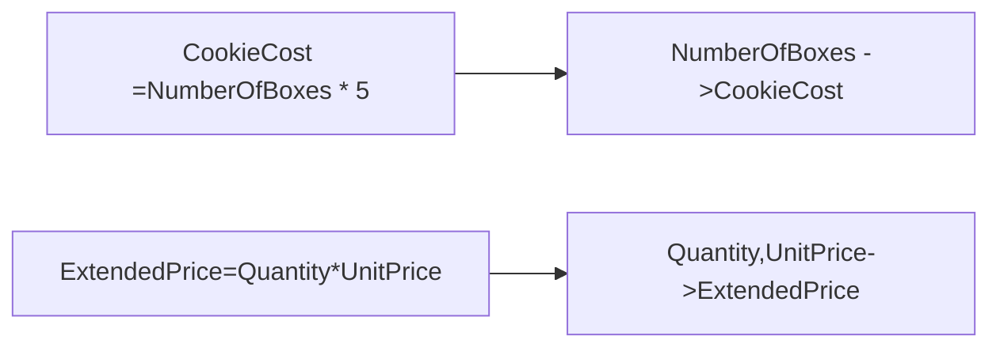

# Chaper 3 The Relational Model And Normalization
[TOC]

## 1. Relational Model Terminology
| Terms | Info |
| -------- | ------ |
| Relation | 关系 |
| Functional dependency . Determinant | 函数依赖.行列式 |
| Candidate key | 候选码 |
| Composite key | 复合码 |
| Primary key | 主码 ||
| Surrogate key | 代理码 |
| Foreign key | 外码 |
| Referential integrity constraint.Normal form | 参照完整性约束.范式 |
| Multivalued dependency | 多值依赖 |

1. Relation
	+ In fact, a relation is a special case of a table. This means that all relations are tables, but not all tables are relations. 
| Characteristics of Relations |
| ------------------------------------ |
| Rows contains data about an entity |
| Columns contain data about attributes of the entities |
| All entries in a column are of the same kind.   Each column has a unique name |
| Cells of the tables hold a single value |
| The order of the column is unimportant |
| The order of the rows is unimportant |
| No two rows may be identical |
> A relation has a specific definition, there is description:
>
> + First, the rows of the table must store data about an entity and the columns of the table must store data about the character-istics of those entities. 
> + Further, in a relation all of the values in a column are of the same  kind.
> +  Also, the names of the columns are unique; no two columns in the same relation may have the same name. 
> + Each cell of a relation has only a single value or item; multiple entries are not allowed.
> +  In a relation, the order of the rows and the order of the columns are immaterial. No information can be carried by the ordering of rows or columns. 
> + For a table to be a relation no two rows can be identical.
> > Even though every cell of a relation must have a single value, this does not mean that all values must have the same length. 

2. Alternative Terminology
> The columns of a relation are called attributes, and the rows of a relation are called tuples 

| Table | Column | Row |
| ------- | ------- | ------ |
| Relation | Attribute | Tuple |
| File | Field | Record |

3. Functional Dependencies
+ Functional dependencies are the heart of the database design process

> NumberOfBoxes determines CookieCost

 	1. Functional Dependencies That Are Not Equations
	+ In general, a functional dependency exists when the value of one or more attributes determines the value of another attribute. Many functional dependencies exist that do not involve equations.
	+ The only reason for having relations is to store instances of functional dependencies.

	2. Composite Functional Dependencies 
		+ The determinant of a functional dependency can consist of more than one attribute

4. Finding Functional
5. Keys
  + In general, a key is a combination of one or more columns that is used to identify particular rows in a relation. Keys that have two columns or more are called composite keys.
  1. Candidate keys
  	+ A candidate key is a determinant that determines all of the other columns in a relation.
  	+ Candidate keys identify a unique row in a relation. Given the value of a candidate key, we can find one and only one row in the relation that has that value.
  2. Primary Keys
  + When designing a database, one of the candidate keys is selected to be the primary key.
  + The primary key can have one column or it can be a composite.
  > we will underline the column(s) that comprise the primary key
  >
  > What do you do if a table has no candidate keys? In that case, define the primary key as the collection of all of the columns in the table. 
  >
  > Thus, the combination of all columns is always  a candidate key. 

3. Surrogate Keys
+ A surrogate key is an artificial column that is added to a table to serve as the primary key. The DBMS assigns a unique value to a surrogate key when the row is created. The assigned value never changes. Surrogate keys are used when the primary key is large and unwieldy. 
+ Create a surrogate key to use numeric key
> Note that surrogate key values are  artificial and have no meaning to the users. In fact, surrogate key values are normally hidden in  forms and reports.

4. Foreign Keys 
+ A foreign key is a column or composite of columns that is the primary key of a table other than the one in which it appears. 
+ We need to ensure that the values of a foreign key match a valid value of a primary key.Thus, we create a referential integrity constraint, which is a statement that limits the values of the foreign key.
	+ SKU in ORDER_ITEM must exist in SKU in SKU_DATA

## 2. Normal Forms
1. Modification Anomalies
	1. Deletion anomaly
	+ When we delete one row, the structure of this table forces us to lose facts about two different things

	2. Insertion anomaly
	+ The structure of this table forces us to enter facts about two entities when we just want to enter facts about one.

	3. Update anomaly
	+ It might be very difficult to detect this error.

2. Normalization Categories
	+ Normalization theory can be divided into three major categories.
		+ Some anomalies arise from functional dependencies
		> BCNF, 3NF, and 2NF, are all concerned with anomalies that are caused by functional dependencies. A relation that is in BCNF has no modification anomalies from functional dependencies.

		+ Some arise from multivalued dependencies
		> Those anomalies can be eliminated by placing each multivalued dependency in a relation of its own, a condition known as 4NF. 

		+ Some arise from data constraints and odd conditions
		>These problems involve specific, rare, and even strange data constraints.

| Source of Anomally | Normal Forms | Design Principles |
| ------ | ------ | ------ |
| Functional dependencies | 1NF,2NF,3NF,BCNF | BCNF:Design tables so that every determinant is a candidate key |
| multivalued dependencies | 4NF | 4NF:Move each multivalued dependencies to table of its own |
| Data constraints and oddities | 5NF,DK/NF | DK/NF:Make every constraint a logical consequence of candidate keys and domains |

3. From First Normal Form to Boyce-Codd Normal
+ This means that:
+ The cells of a table must be a single value, and neither repeating groups nor arrays are allowed as values
+ All entries in a column must be of the same data type
+ Each column must have a unique name, but the order of the columns in the table is not significant
+ No two rows in a table may be identical, but the order of the rows is not significant

4. Second Normal Form
+  A relation is 2NF if and only if it is in 1NF and all non-key attributes are determined by the entire primary key.
+  This means that if the primary key is a composite primary key, then no non-key attribute can be determined by an attribute or set of attrib-utes that make up only part of the key. 
>  Note that the only way a non-key attribute can be dependent on part of the primary key is if there is a composite primary key. 
>  This means that relations with single-attribute primary keys are automatically in 2NF

5. Third Normal Form
+ A relation is in 3NF if and only if it is in 2NF and there are no non-key attributes determined by another non-key attribute. 
> A relation is in 3NF if and only if it is in 2NF and it has no transitive dependencies.

+ To put the relation into 3NF, we will have to move the columns of the functional dependency into a separate relation while leaving the determinant in the original relation as a foreign key. 

6. Boyce-Codd Normal Form
+ A relation is in BCNF if and only if it is in 3NF and every determinant is a candidate key.
